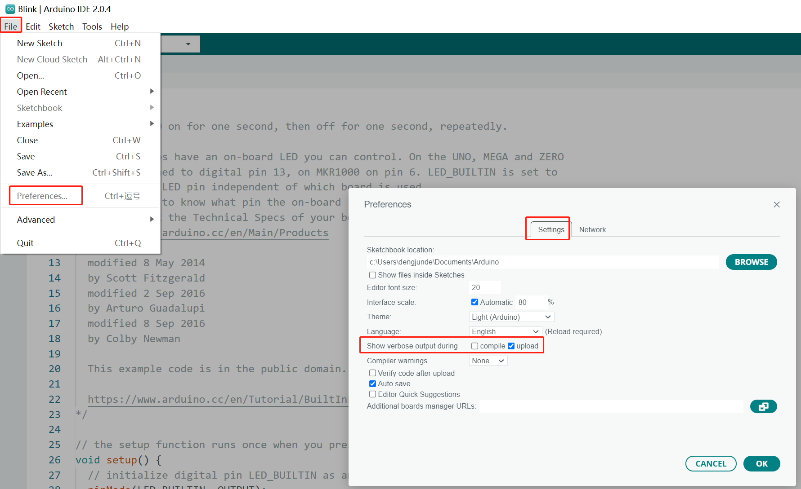
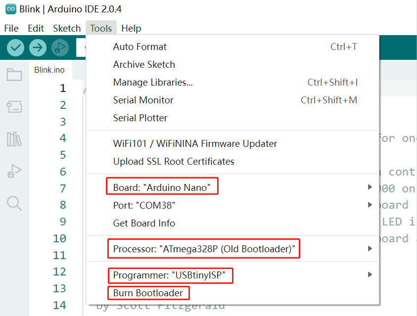
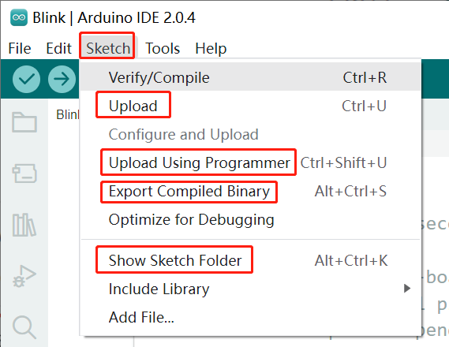
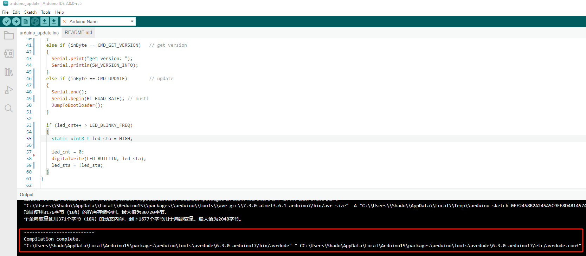

# arduino_update
[Arduino入门参考](https://blog.csdn.net/qq_29506411/article/details/134164156)

## How to use?
1. open upload log output.

2. burn bootloader(must use the downloader).

According to your kit, select the relative configuration, then click `Burn Bootloader`.
3. upload app(by UART): click `Sketch-->Upload`.
\
Then, you will see the upload command in the output window of `Arduino IDE`:

4. modify the [script](./upload_cmd.py) for uploading:
> - modify the UART Port. (line7 & line13)
> - modify the upload cmd according the output of last step. (line13) (you can change `-v` to `-vvvvv` see more details)
5. run the [script](./upload_cmd.py):
```shell
python upload_cmd.py
```
